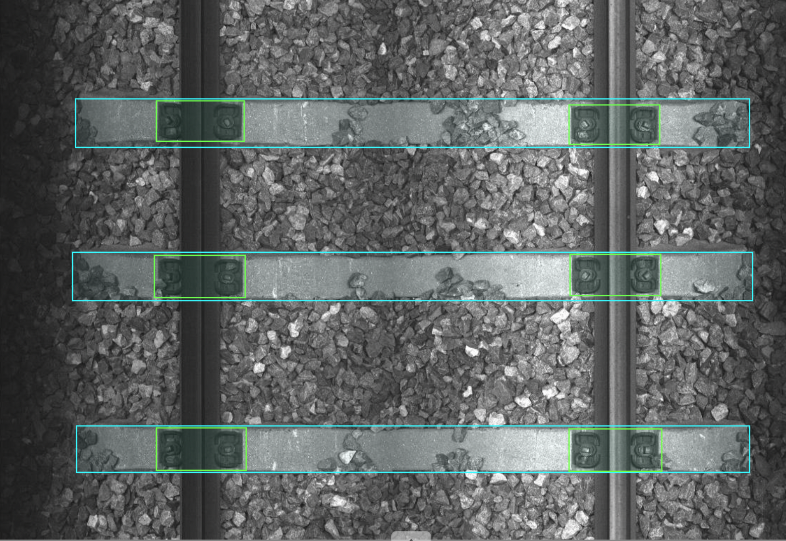
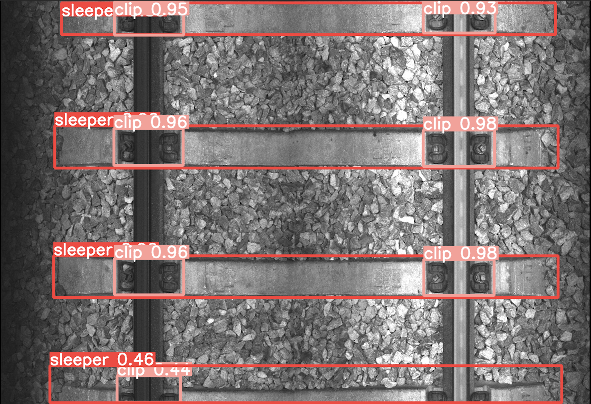
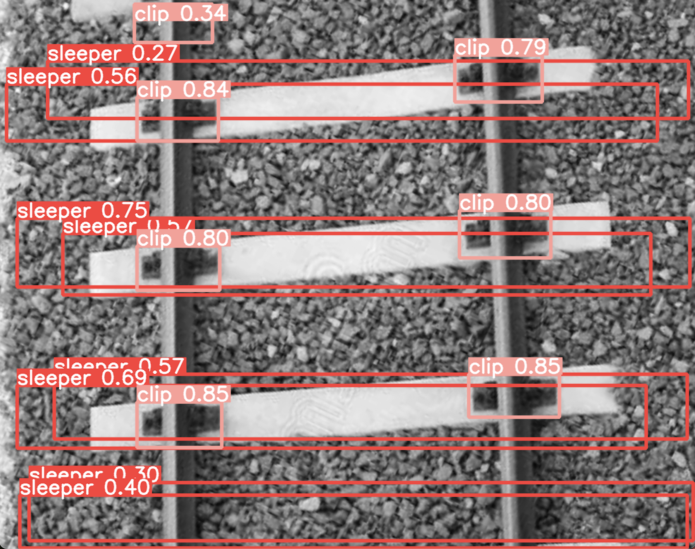

# Sleeper and Clips Detection with YOLO

This project aims to detect specific objects using the YOLO (You Only Look Once) object detection algorithm. Our focus is on identifying "sleepers" and "clips" in images. This README outlines our annotation methodology and the steps for training and testing the YOLO model.

**Quick Start**:
If environment requirements are already satisfied one can simply run `python train.py` followed by `python detect.py`.

## Annotation Methodology

To ensure high-quality object detection, we meticulously annotate our image dataset. We use CVAT (Computer Vision Annotation Tool) for this purpose, following a precise methodology to maintain consistency and accuracy across the dataset.

### Step 1: Setting Up CVAT

- CVAT is an open-source, web-based tool used for the annotation of images and videos.
- Installation instructions are available at [CVAT GitHub page](https://github.com/openvinotoolkit/cvat).

### Step 2: Preparing Images for Annotation

- Organize images into two main directories within the project: `train` and `val`, for training and validation purposes, respectively.
- Ensure images are in a supported format (e.g., JPG, PNG).

### Step 3: Creating Annotation Tasks in CVAT

- Create new tasks in CVAT for both training and validation images. Provide descriptive names for each task.
- Upload images to their respective tasks.

### Step 4: Labeling Guidelines

- Define labels according to the objects of interest (e.g., "sleeper", "clip").
- Draw bounding boxes around each instance of the objects in the images.
- Ensure consistency by adhering to the defined labeling guidelines.

### Step 5: Exporting Annotations

- After completing the annotations, export the data in YOLO format.
- Organize the exported annotations to match the directory structure of the images.

## YOLO Model Training

With the dataset annotated, we proceed to train the YOLO model. This section covers the basic steps required for training.

### Pre-requisites

- Ensure a YOLO-compatible framework is installed (e.g., Darknet, YOLOv8 repository).
- Python 3.6 or later.

### Training the Model

1. **Prepare Your Environment**:
   - Clone the YOLOv8 GitHub repository: `git clone https://github.com/ultralytics/yolov8.git`.
   - Install requirements: `cd yolov8 && pip install -r requirements.txt`.

2. **Configure Your Dataset**:
   - Update the dataset configuration file, `dataset.yaml`, to reflect the dataset's path and class names.

3. **Training**:
   - Use the following command to start training: `python train.py`.
   - (Optional) Adjust `--img`, `--batch`, `--epochs`, and `--weights` as necessary based on the dataset and desired model complexity.

4. **Monitoring Training**:
   - Monitor training progress and performance using TensorBoard: `tensorboard --logdir runs/train`.

## YOLO Model Detection
After training the YOLO model, the next step involves applying the model to detect objects in new images.

### Pre-requisites
   - A trained YOLO model in ONNX format.
   - Python 3.6 or later installed on your system.
   - The Ultralytics YOLO framework installed (as part of the setup from the training section).

### Running Detection Model

1. **Prepare the Detection Script**:

   - Verify that detect.py correctly specifies the path to the trained ONNX model, which is generated upon completing the training process (e.g., runs/detect/train6/weights/best.onnx). Also, ensure it points to the images you intend to analyze. 

3. **Run Detection**:
   - Execute your script with Python to start the detection process: `python detect.py`.
   - The script will load each specified image, run detection, and display the results. 

4. **Monitoring and Results**:
   - The detect.py script will output the detection results, which include the class names and confidence scores for detected objects, directly to your console or GUI window.

### Val Image Result

- The detection successfully identifies all sleepers and clips within the image from the validation set. This includes a partially visible sleeper and a clip, detected with confidence scores of 0.46 and 0.44, respectively.

### Test Image Result

- The detection process identifies all sleepers and clips, although it draws two boxes for the sleepers, likely due to the different angle and plane of the test image.
- A more robust detection of accurate sleepers and clips can be achieved by applying a confidence threshold filter (e.g., 0.5).

## Contributing

Contributions to improve the model or annotations are welcome. Please follow the standard GitHub fork and pull request workflow.